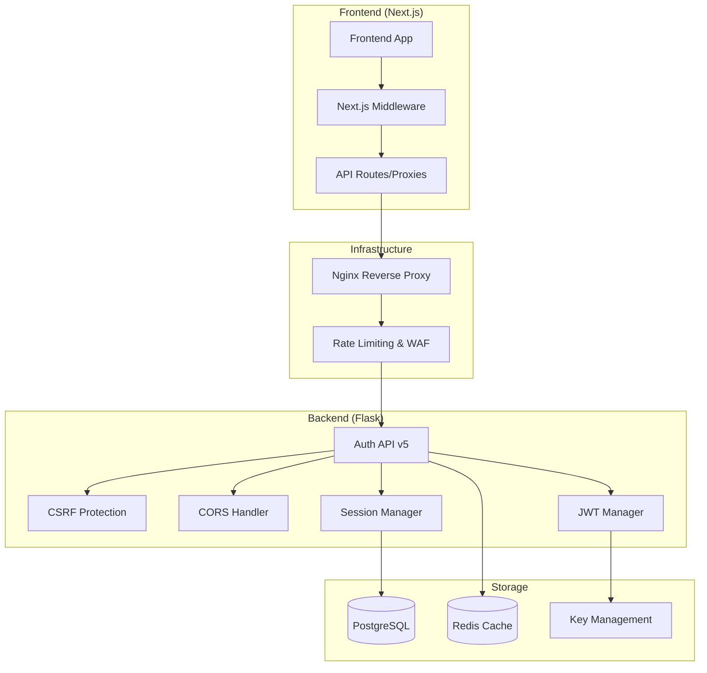
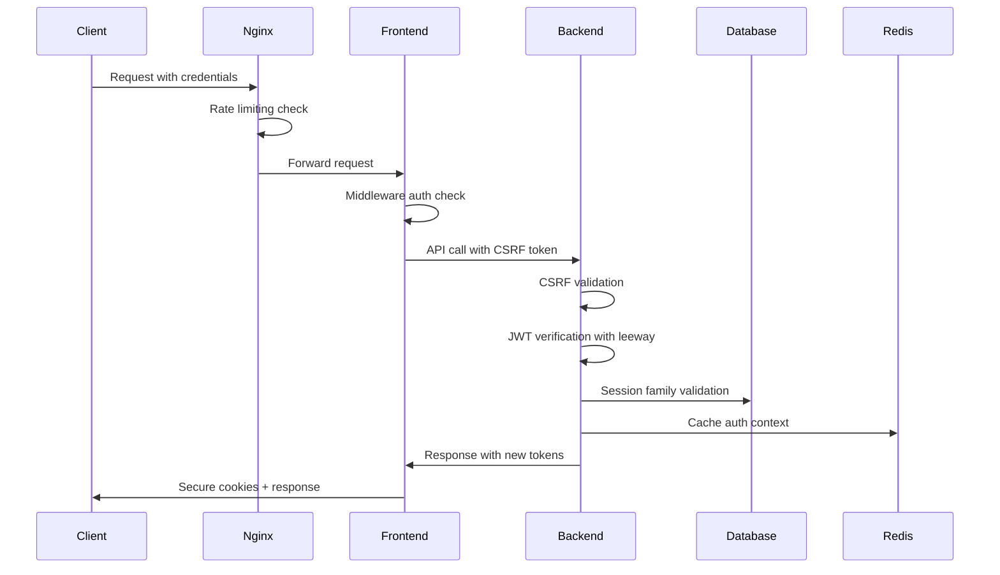
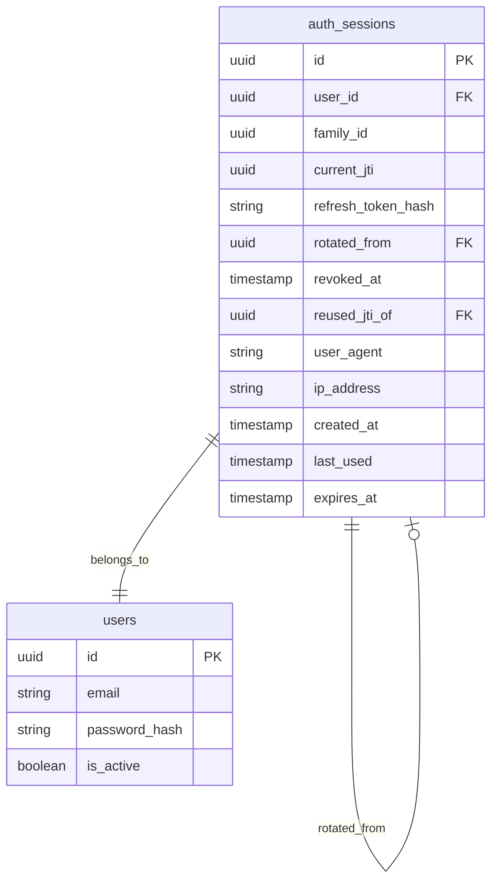

# Design Document

## Overview

This design implements comprehensive authentication security hardening for the JewGo platform, addressing critical vulnerabilities through a phased approach that includes CSRF protection, secure token rotation, environment-aware policies, and comprehensive monitoring. The solution builds upon the existing PostgreSQL-based authentication system while adding enterprise-grade security features.

## Architecture

### High-Level Architecture



### Security Flow Architecture



## Components and Interfaces

### 1. CSRF Protection System

#### CSRFManager Class
```python
class CSRFManager:
    def __init__(self, secret_key: str):
        self.secret_key = secret_key
    
    def generate_token(self, session_id: str, user_agent: str) -> str:
        """Generate HMAC-based CSRF token with day bucket"""
        
    def validate_token(self, token: str, session_id: str, user_agent: str) -> bool:
        """Validate CSRF token with timing attack protection"""
        
    def get_csrf_cookie_config(self) -> dict:
        """Get environment-aware cookie configuration"""
```

#### CSRF Middleware Integration
- Blueprint-wide `before_request` hook for mutating methods
- Double-submit cookie pattern with HMAC validation
- GET `/api/v5/auth/csrf` endpoint for token issuance
- 403 Forbidden responses for invalid/missing tokens

### 2. Enhanced Token Management

#### TokenManagerV5 Class
```python
class TokenManagerV5:
    def __init__(self, private_key: str, public_key: str, leeway: int = 60):
        self.private_key = private_key
        self.public_key = public_key
        self.leeway = leeway
    
    def verify_token(self, token: str, leeway: int = None) -> Optional[dict]:
        """Verify JWT with configurable leeway for clock skew"""
        
    def mint_access_token(self, user_data: dict, ttl: int = 3600) -> Tuple[str, int]:
        """Mint access token with JTI and enhanced claims"""
        
    def mint_refresh_token(self, user_id: str, session_id: str, family_id: str) -> Tuple[str, int]:
        """Mint refresh token with session binding"""
```

#### Session Family Management
```python
class SessionFamilyManager:
    def create_session_family(self, user_id: str, device_info: dict) -> str:
        """Create new session family with device binding"""
        
    def rotate_session(self, family_id: str, current_jti: str, new_jti: str) -> bool:
        """Rotate session within family, detect replay attacks"""
        
    def revoke_family(self, family_id: str, reason: str) -> None:
        """Revoke entire session family"""
        
    def list_user_sessions(self, user_id: str) -> List[dict]:
        """List active sessions for user management"""
```

### 3. Environment-Aware Configuration

#### CookiePolicyManager Class
```python
class CookiePolicyManager:
    def __init__(self, environment: str):
        self.environment = environment
    
    def get_cookie_config(self) -> dict:
        """Get environment-specific cookie configuration"""
        # Production: Secure, HttpOnly, SameSite=None, Domain=.jewgo.app
        # Preview: host-only, SameSite=None
        # Development: relaxed settings
        
    def get_cors_config(self) -> dict:
        """Get CORS configuration from FRONTEND_ORIGINS"""
```

#### CORS Handler
```python
class CORSHandler:
    def __init__(self, allowed_origins: List[str]):
        self.allowed_origins = allowed_origins
    
    def handle_preflight(self, request) -> Response:
        """Handle CORS preflight requests"""
        
    def add_cors_headers(self, response, origin: str) -> Response:
        """Add CORS headers to response"""
```

### 4. Frontend Security Enhancements

#### Enhanced Auth Client
```typescript
class PostgresAuthClientV5 {
    private refreshPromise: Promise<AuthTokens> | null = null;
    private refreshAttempts: number = 0;
    private maxRefreshAttempts: number = 2;
    
    async request(endpoint: string, options: RequestInit): Promise<Response> {
        // Implement deduplication, timeout, retry logic
    }
    
    async refreshWithBackoff(): Promise<AuthTokens> {
        // Exponential backoff with jitter
    }
    
    async handleAuthError(error: PostgresAuthError): Promise<void> {
        // Clear state on 403, implement loop guard
    }
}
```

#### Next.js Middleware Enhancement
```typescript
export function middleware(request: NextRequest) {
    // Use HEAD /verify-token for performance
    // Preserve returnTo parameter
    // Apply only to protected routes
}
```

### 5. Infrastructure Security

#### Nginx Configuration
```nginx
# Rate limiting
limit_req_zone $binary_remote_addr zone=auth:10m rate=10r/m;

# Auth endpoints
location /api/v5/auth/ {
    limit_req zone=auth burst=5 nodelay;
    proxy_cookie_domain ~^(.*)$ .jewgo.app;  # Production only
    add_header Cache-Control "no-cache, no-store, must-revalidate";
}
```

#### Health Check System
```python
class HealthChecker:
    def check_auth_system(self) -> dict:
        """Comprehensive auth system health check"""
        return {
            'jwt_key_present': bool(self.jwt_manager.private_key),
            'csrf_secret_configured': bool(self.csrf_manager.secret_key),
            'cors_origins_configured': len(self.cors_handler.allowed_origins) > 0,
            'database_connectivity': self.test_db_connection(),
            'redis_connectivity': self.test_redis_connection()
        }
```

## Data Models

### Enhanced auth_sessions Table Schema
```sql
-- Migration to add required fields
ALTER TABLE auth_sessions ADD COLUMN IF NOT EXISTS family_id UUID;
ALTER TABLE auth_sessions ADD COLUMN IF NOT EXISTS current_jti UUID;
ALTER TABLE auth_sessions ADD COLUMN IF NOT EXISTS revoked_at TIMESTAMP;
ALTER TABLE auth_sessions ADD COLUMN IF NOT EXISTS reused_jti_of UUID;

-- Indexes for performance
CREATE INDEX IF NOT EXISTS idx_auth_sessions_family_id ON auth_sessions(family_id);
CREATE INDEX IF NOT EXISTS idx_auth_sessions_current_jti ON auth_sessions(current_jti);
CREATE INDEX IF NOT EXISTS idx_auth_sessions_revoked_at ON auth_sessions(revoked_at) WHERE revoked_at IS NOT NULL;
```

### Session Management Data Flow


### CSRF Token Structure
```typescript
interface CSRFToken {
    session_id: string;
    user_agent_hash: string;
    day_bucket: string;
    hmac_signature: string;
}
```

## Error Handling

### Error Classification System
```python
class AuthErrorTypes:
    CSRF_INVALID = "CSRF_INVALID"
    TOKEN_EXPIRED = "TOKEN_EXPIRED"
    TOKEN_REPLAY = "TOKEN_REPLAY"
    FAMILY_REVOKED = "FAMILY_REVOKED"
    RATE_LIMITED = "RATE_LIMITED"
    CORS_VIOLATION = "CORS_VIOLATION"
    NETWORK_ERROR = "NETWORK_ERROR"
```

### Frontend Error Handling
```typescript
class AuthErrorHandler {
    handle(error: PostgresAuthError): AuthAction {
        switch (error.code) {
            case 'CSRF_INVALID':
                return { type: 'REFRESH_CSRF', retry: true };
            case 'TOKEN_EXPIRED':
                return { type: 'REFRESH_TOKEN', retry: true };
            case 'FAMILY_REVOKED':
                return { type: 'FORCE_LOGOUT', retry: false };
            case 'RATE_LIMITED':
                return { type: 'BACKOFF', retryAfter: error.retryAfter };
            default:
                return { type: 'GENERIC_ERROR', retry: false };
        }
    }
}
```

### Backend Error Responses
```python
def create_auth_error_response(error_type: str, details: dict = None) -> Response:
    """Create standardized auth error response"""
    return jsonify({
        'success': False,
        'error': {
            'type': error_type,
            'message': AUTH_ERROR_MESSAGES[error_type],
            'details': details or {},
            'correlation_id': g.correlation_id,
            'timestamp': datetime.utcnow().isoformat()
        }
    }), AUTH_ERROR_STATUS_CODES[error_type]
```

## Testing Strategy

### Security Test Categories

#### 1. CSRF Protection Tests
```python
class TestCSRFProtection:
    def test_csrf_token_generation(self):
        """Test CSRF token generation and validation"""
        
    def test_csrf_missing_token_rejection(self):
        """Test rejection of requests without CSRF token"""
        
    def test_csrf_invalid_token_rejection(self):
        """Test rejection of requests with invalid CSRF token"""
        
    def test_csrf_timing_attack_resistance(self):
        """Test CSRF validation timing attack resistance"""
```

#### 2. Token Rotation Tests
```python
class TestTokenRotation:
    def test_successful_token_rotation(self):
        """Test successful token rotation flow"""
        
    def test_replay_attack_detection(self):
        """Test detection and handling of replay attacks"""
        
    def test_family_revocation(self):
        """Test family-wide token revocation"""
        
    def test_concurrent_refresh_handling(self):
        """Test handling of concurrent refresh requests"""
```

#### 3. Frontend Integration Tests
```typescript
describe('Auth Client Security', () => {
    test('should handle 401 loops with backoff', async () => {
        // Test infinite refresh loop prevention
    });
    
    test('should deduplicate concurrent refresh requests', async () => {
        // Test request deduplication
    });
    
    test('should timeout requests appropriately', async () => {
        // Test request timeout handling
    });
});
```

#### 4. Infrastructure Tests
```bash
#!/bin/bash
# test-auth-security.sh

# Test rate limiting
test_rate_limiting() {
    for i in {1..15}; do
        curl -s -o /dev/null -w "%{http_code}\n" \
            -X POST https://api.jewgo.app/api/v5/auth/login \
            -H "Content-Type: application/json" \
            -d '{"email":"test@example.com","password":"test"}'
    done
}

# Test CORS headers
test_cors_headers() {
    curl -H "Origin: https://jewgo.app" \
         -H "Access-Control-Request-Method: POST" \
         -H "Access-Control-Request-Headers: X-CSRF-Token" \
         -X OPTIONS https://api.jewgo.app/api/v5/auth/login
}
```

### Performance Testing
```python
class TestAuthPerformance:
    def test_verify_token_latency(self):
        """Test token verification latency (target: <120ms p95)"""
        
    def test_csrf_validation_performance(self):
        """Test CSRF validation performance impact"""
        
    def test_session_rotation_performance(self):
        """Test session rotation performance under load"""
```

### Security Penetration Testing
```python
class TestSecurityPenetration:
    def test_csrf_bypass_attempts(self):
        """Test various CSRF bypass techniques"""
        
    def test_token_manipulation_attacks(self):
        """Test JWT token manipulation attacks"""
        
    def test_session_fixation_attacks(self):
        """Test session fixation attack prevention"""
        
    def test_timing_attack_resistance(self):
        """Test timing attack resistance across auth flows"""
```

## Monitoring and Observability

### Metrics Collection
```python
class AuthMetrics:
    def __init__(self, metrics_client):
        self.metrics = metrics_client
    
    def record_login_attempt(self, result: str, method: str):
        """Record login attempt with result and method"""
        self.metrics.increment('auth.login.attempts', 
                             tags={'result': result, 'method': method})
    
    def record_csrf_validation(self, result: str):
        """Record CSRF validation result"""
        self.metrics.increment('auth.csrf.validations',
                             tags={'result': result})
    
    def record_token_verification_latency(self, duration_ms: float):
        """Record token verification latency"""
        self.metrics.histogram('auth.token.verify.latency', duration_ms)
```

### Security Event Logging
```python
class SecurityEventLogger:
    def log_auth_event(self, event_type: str, user_id: str = None, **kwargs):
        """Log security event with PII masking"""
        event = {
            'event_type': event_type,
            'user_id': self.mask_pii(user_id),
            'timestamp': datetime.utcnow().isoformat(),
            'correlation_id': g.correlation_id,
            'ip_address': self.get_client_ip(),
            'user_agent': self.mask_user_agent(request.headers.get('User-Agent')),
            **kwargs
        }
        logger.info(f"Security Event: {json.dumps(event)}")
```

### Alert Configuration
```yaml
# Prometheus alerting rules
groups:
  - name: auth_security
    rules:
      - alert: HighAuthFailureRate
        expr: rate(auth_login_attempts_total{result="failure"}[5m]) > 0.1
        for: 5m
        labels:
          severity: warning
        annotations:
          summary: "High authentication failure rate detected"
          
      - alert: CSRFAttackDetected
        expr: rate(auth_csrf_validations_total{result="invalid"}[5m]) > 0.05
        for: 2m
        labels:
          severity: critical
        annotations:
          summary: "Potential CSRF attack detected"
          
      - alert: TokenVerificationLatencyHigh
        expr: histogram_quantile(0.95, auth_token_verify_latency) > 200
        for: 5m
        labels:
          severity: warning
        annotations:
          summary: "Token verification latency is high"
```

## Deployment Strategy

### Phased Rollout Plan

#### Phase 1: Backend Security Foundation (Days 1-2)
- Deploy CSRF protection system
- Implement enhanced token verification with leeway
- Add security headers middleware
- Deploy basic metrics collection

#### Phase 2: Session Management Enhancement (Days 3-5)
- Deploy session family management
- Implement token rotation with replay detection
- Add environment-aware cookie policies
- Deploy CORS enhancements

#### Phase 3: Frontend Security Integration (Days 6-7)
- Deploy enhanced auth client with loop guards
- Implement Next.js middleware improvements
- Deploy API proxy enhancements
- Add frontend error handling

#### Phase 4: Infrastructure Hardening (Days 8-9)
- Deploy Nginx rate limiting and security headers
- Implement health check enhancements
- Deploy monitoring and alerting
- Conduct security testing

#### Phase 5: Canary Deployment (Day 10)
- Deploy with A/B cookie names for 5% of traffic
- Monitor metrics for 48-72 hours
- Full rollout or rollback based on metrics

### Rollback Strategy
```python
class AuthRollbackManager:
    def initiate_rollback(self, reason: str):
        """Initiate auth system rollback"""
        # 1. Stop issuing new v5 cookies
        # 2. Continue accepting both v4 and v5 cookies
        # 3. Gradually expire v5 cookies
        # 4. Monitor for issues
        # 5. Complete rollback to v4 if needed
```

### Configuration Management
```python
# Environment-specific configuration
AUTH_CONFIG = {
    'production': {
        'cookie_domain': '.jewgo.app',
        'cors_origins': ['https://jewgo.app'],
        'csrf_secret_required': True,
        'rate_limit_strict': True
    },
    'preview': {
        'cookie_domain': None,  # host-only
        'cors_origins': ['https://*.vercel.app'],
        'csrf_secret_required': True,
        'rate_limit_strict': False
    },
    'development': {
        'cookie_domain': None,
        'cors_origins': ['http://localhost:3000'],
        'csrf_secret_required': False,
        'rate_limit_strict': False
    }
}
```

This design provides a comprehensive, secure, and maintainable authentication system that addresses all identified security vulnerabilities while maintaining backward compatibility and providing clear upgrade paths.