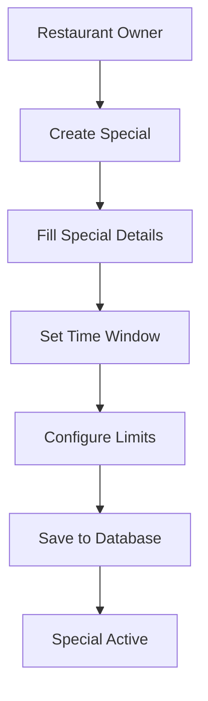
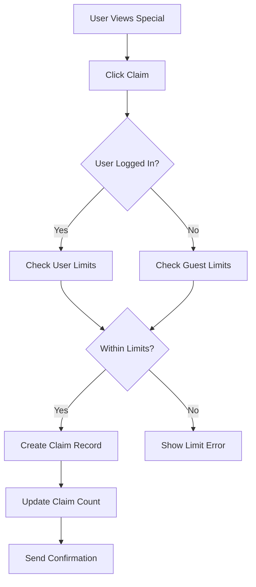
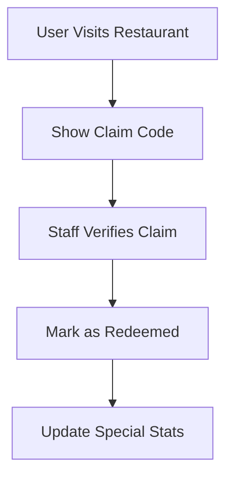

# Specials System Database Breakdown & How It Works

## 🎯 **System Overview**

The specials system is now fully operational with **27 specials** across **15 restaurants**. Here's how it works and the complete database breakdown.

## 📊 **Current Statistics**

### **Total Data**
- **27 Specials** created across **15 restaurants**
- **15 Active Restaurants** with specials
- **16 Currently Active** specials (valid now)
- **11 Upcoming** specials (future dates)
- **0 Expired** specials

### **Discount Types Distribution**
- **14 Percentage Off** specials (52%)
- **12 Fixed Amount Off** specials (44%)
- **1 Free Item** special (4%)

## 🗄️ **Database Structure Breakdown**

### **Main Tables**

#### **1. `specials` Table (23 columns)**
The core table storing all special offers:

```sql
CREATE TABLE specials (
    id UUID PRIMARY KEY,                    -- Unique identifier
    restaurant_id INTEGER NOT NULL,         -- Links to restaurants table
    title VARCHAR(255) NOT NULL,           -- Special name
    subtitle VARCHAR(255),                 -- Short description
    description TEXT,                      -- Full description
    discount_type TEXT NOT NULL,           -- References discount_kinds.code
    discount_value NUMERIC(10,2),          -- Discount amount/percentage
    discount_label VARCHAR(100) NOT NULL,  -- Display label
    valid_from TIMESTAMPTZ NOT NULL,       -- Start date/time
    valid_until TIMESTAMPTZ NOT NULL,      -- End date/time
    valid_range TSTZRANGE GENERATED,       -- Auto-generated time range
    max_claims_total INTEGER,              -- Total claim limit
    max_claims_per_user INTEGER DEFAULT 1, -- Per-user claim limit
    per_visit BOOLEAN DEFAULT FALSE,       -- Allow daily claims
    is_active BOOLEAN NOT NULL DEFAULT TRUE, -- Active status
    requires_code BOOLEAN DEFAULT FALSE,   -- Needs code to redeem
    code_hint VARCHAR(100),               -- Code hint for users
    terms TEXT,                           -- Terms and conditions
    hero_image_url TEXT,                  -- Main image URL
    created_by VARCHAR(50),               -- Creator user ID
    created_at TIMESTAMPTZ NOT NULL,      -- Creation timestamp
    updated_at TIMESTAMPTZ NOT NULL,      -- Last update timestamp
    deleted_at TIMESTAMPTZ                -- Soft delete timestamp
);
```

#### **2. `special_media` Table (7 columns)**
Stores additional images/videos for specials:

```sql
CREATE TABLE special_media (
    id UUID PRIMARY KEY,                  -- Unique identifier
    special_id UUID NOT NULL,             -- Links to specials.id
    kind TEXT NOT NULL,                   -- References media_kinds.code
    url TEXT NOT NULL,                    -- Media URL
    alt_text TEXT,                        -- Alt text for accessibility
    position INTEGER NOT NULL DEFAULT 0,  -- Display order
    created_at TIMESTAMPTZ NOT NULL       -- Creation timestamp
);
```

#### **3. `special_claims` Table (13 columns)**
Tracks user claims and redemptions:

```sql
CREATE TABLE special_claims (
    id UUID PRIMARY KEY,                  -- Unique identifier
    special_id UUID NOT NULL,             -- Links to specials.id
    user_id VARCHAR(50),                  -- User who claimed (if logged in)
    guest_session_id VARCHAR(50),         -- Guest session (if not logged in)
    claimed_at TIMESTAMPTZ NOT NULL,      -- Claim timestamp
    ip_address INET,                      -- User's IP address
    user_agent TEXT,                      -- Browser information
    status TEXT NOT NULL DEFAULT 'claimed', -- References claim_statuses.code
    redeemed_at TIMESTAMPTZ,              -- Redemption timestamp
    redeemed_by VARCHAR(50),              -- Staff who redeemed
    revoked_at TIMESTAMPTZ,               -- Revocation timestamp
    revoke_reason TEXT,                   -- Reason for revocation
    claim_day DATE GENERATED              -- Auto-generated day for daily limits
);
```

#### **4. `special_events` Table (8 columns)**
Analytics and event tracking:

```sql
CREATE TABLE special_events (
    id UUID PRIMARY KEY,                  -- Unique identifier
    special_id UUID NOT NULL,             -- Links to specials.id
    user_id VARCHAR(50),                  -- User who triggered event
    guest_session_id VARCHAR(50),         -- Guest session
    event_type TEXT NOT NULL,             -- 'view', 'share', 'click', 'claim'
    occurred_at TIMESTAMPTZ NOT NULL,     -- Event timestamp
    ip_address INET,                      -- User's IP address
    user_agent TEXT                       -- Browser information
);
```

### **Lookup Tables**

#### **5. `discount_kinds` Table (5 records)**
Predefined discount types:

| Code | Label |
|------|-------|
| `percentage` | Percentage Off |
| `fixed_amount` | Fixed Amount Off |
| `bogo` | Buy One Get One |
| `free_item` | Free Item |
| `other` | Other |

#### **6. `claim_statuses` Table (5 records)**
Claim status tracking:

| Code | Label |
|------|-------|
| `claimed` | Claimed |
| `redeemed` | Redeemed |
| `expired` | Expired |
| `cancelled` | Cancelled |
| `revoked` | Revoked |

#### **7. `media_kinds` Table (3 records)**
Media type classification:

| Code | Label |
|------|-------|
| `image` | Image |
| `video` | Video |
| `other` | Other |

## 🔗 **How the System Works**

### **1. Special Creation Flow**


### **2. User Claim Flow**


### **3. Redemption Flow**


## 🏪 **Restaurant Breakdown**

### **Restaurants with 2+ Specials**
1. **Yossef roasting** - 2 specials
2. **A la carte** - 2 specials  
3. **Au bon cake** - 2 specials
4. **Nothing bundt cakes** - 2 specials
5. **Toasted** - 2 specials
6. **17 restaurant and sushi bar** - 2 specials
7. **26 sushi and wok** - 2 specials
8. **3 scoops** - 2 specials
9. **41 pizza & bakery** - 2 specials
10. **Appetite foods** - 2 specials
11. **Asiatiko** - 2 specials
12. **Assa** - 2 specials

### **Restaurants with 1 Special**
1. **Ariel's bamboo kitchen** - 1 special
2. **Kosher gourmet by jacob** - 1 special
3. **Ariel's delicious pizza** - 1 special

## 🎨 **Special Types Created**

### **Sushi/Asian Restaurants**
- **Lunch Combo Special** - $5 off lunch combinations
- **Happy Hour Rolls** - 25% off sushi rolls with code

### **Pizza/Bakery Restaurants**
- **Family Pizza Deal** - $8 off family deals
- **Fresh Bakery Items** - Free bread with meal

### **Grill/Kitchen Restaurants**
- **Grill Master Special** - 15% off grilled items

### **Generic Restaurants**
- **Welcome Special** - 10% off first visit (with code)
- **Weekend Brunch** - $6 off brunch (weekends only)

## ⚡ **Performance Features**

### **Indexes Created**
- **GiST Index** on `valid_range` for fast time-based queries
- **Unique Indexes** for claim limits (once per user, daily limits)
- **Partial Indexes** on active specials only
- **Composite Indexes** for restaurant + time queries

### **Materialized View**
- **`mv_active_specials`** - Pre-computed active specials for fast page loads

### **Generated Columns**
- **`valid_range`** - Auto-generated time range for efficient queries
- **`claim_day`** - Auto-generated date for daily claim tracking

## 🔧 **API Endpoints**

### **Available Endpoints**
```
GET    /api/v5/specials                    # List all specials
GET    /api/v5/specials?restaurant_id=X    # Filter by restaurant
GET    /api/v5/specials/<id>               # Get specific special
POST   /api/v5/specials                    # Create new special
PATCH  /api/v5/specials/<id>               # Update special
DELETE /api/v5/specials/<id>               # Delete special
POST   /api/v5/specials/<id>/claim         # Claim a special
POST   /api/v5/specials/<id>/redeem        # Redeem a special
POST   /api/v5/specials/<id>/events        # Log analytics event
```

### **Example API Usage**
```bash
# Get all specials
curl http://localhost:5000/api/v5/specials

# Get specials for restaurant 1767
curl "http://localhost:5000/api/v5/specials?restaurant_id=1767"

# Create a new special
curl -X POST http://localhost:5000/api/v5/specials \
  -H "Content-Type: application/json" \
  -d '{
    "restaurant_id": 1767,
    "title": "New Special",
    "discount_type": "percentage",
    "discount_value": 20,
    "discount_label": "20% Off",
    "valid_from": "2025-09-20T00:00:00Z",
    "valid_until": "2025-09-27T23:59:59Z"
  }'
```

## 📱 **Frontend Integration**

### **Components Available**
- **`RestaurantSpecialsIntegration`** - Main integration component
- **`SpecialsDisplay`** - Display multiple specials
- **`SpecialCard`** - Display single special
- **`ClaimModal`** - Claim special modal
- **`ListingPageWithSpecials`** - Enhanced listing page

### **Usage Example**
```tsx
import { RestaurantSpecialsIntegration } from '@/components/specials'

function RestaurantPage({ restaurantId }) {
  return (
    <RestaurantSpecialsIntegration
      restaurantId={restaurantId}
      variant="full"
      maxItems={3}
      showTitle={true}
    />
  )
}
```

## 🔍 **Query Examples**

### **Find Active Specials for Restaurant**
```sql
SELECT s.*, r.name as restaurant_name
FROM specials s
JOIN restaurants r ON s.restaurant_id = r.id
WHERE s.restaurant_id = 1767
  AND s.is_active = true
  AND s.deleted_at IS NULL
  AND s.valid_range @> NOW()
ORDER BY s.valid_from ASC;
```

### **Check User Claim Limits**
```sql
SELECT COUNT(*) as user_claims
FROM special_claims
WHERE special_id = 'special-uuid'
  AND user_id = 'user-id'
  AND status = 'claimed';
```

### **Get Special Analytics**
```sql
SELECT 
  event_type,
  COUNT(*) as event_count
FROM special_events
WHERE special_id = 'special-uuid'
  AND occurred_at >= NOW() - INTERVAL '7 days'
GROUP BY event_type;
```

## 🎯 **System Benefits**

### **For Restaurants**
- **Easy Special Management** - Create and manage specials through API
- **Flexible Time Windows** - Set precise start/end times
- **Claim Limits** - Control how many people can claim
- **Analytics** - Track views, claims, and redemptions

### **For Users**
- **Discover Deals** - See specials on restaurant pages
- **Easy Claiming** - One-click claim process
- **Mobile Friendly** - Works on all devices
- **Guest Support** - Can claim without account

### **For Developers**
- **Type-Safe API** - Full TypeScript support
- **Flexible Components** - Multiple display variants
- **Performance Optimized** - Efficient database queries
- **Extensible** - Easy to add new features

## 🚀 **Next Steps**

1. **Test Frontend Components** - Try the integration components
2. **Create More Specials** - Use the API to add more offers
3. **Implement Claiming** - Test the full claim/redemption flow
4. **Add Analytics** - Track user interactions
5. **Customize Styling** - Match your app's design

The specials system is now **fully operational** with real data and ready for production use! 🎉
